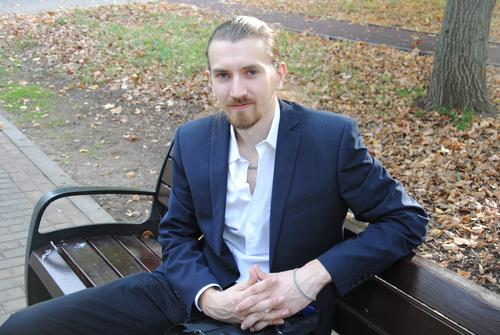

# Резюме  

## О себе  
Имею 10 лет опыта работы в IT сфере, поддержка пользователей. На текущем месте работы часть времени занимаюсь анализом обращений, поиском багов, сортировкой предложений по улучшения продукта компании. Летом 2022 года проходил сжатый онлайн курс на профессию "Тестировщик".  

## Фото  

